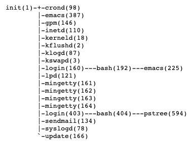

# 3장: 프로세스 관리

### 개요

이번 장에서는 커널이 프로세스를 어떻게 생성하고 삭제하는지를 알아봅니다. 다만 일반적인 프로세스는 당연히 가상 메모리를 사용하기 때문에 5장에서 알아볼 가상 메모리에 대해 모르는 상태에서는 반쪽 지식입니다. 

따라서 이번 장에서는 가상 메모리가 없다고 가정하고 알아보겠습니다.

---

### 프로세스를 생성하는 법

- 리눅스에서 프로세스를 생성하는 목적은 2가지입니다. 같은 프로그램의 처리를 여러 프로세스가 나누는 경우와 전혀 다른 프로그램을 생성하는 경우입니다.
- 이 때 같은 프로그램의 처리를 여러 프로세스가 나눌 수 있도록 프로세스를 새롭게 생성하는 경우는 반드시 `fork()` 함수만 사용합니다.
    - fork()는 이미 존재하는 부모 프로세스와 별개로 자식 프로세스용 메모리를 작성한 뒤 부모 프로세스의 메모리를 복사합니다. 이 때 복사된 메모리에서 프로세스는 서로 분기되어 서로 각각 다른 코드를 실행할 수 있습니다.
    - fork() 함수가 리턴될 때 부모 프로세스는 자식 프로세스의 프로세스 ID를, 자식 프로세스는 부모 프로세스는 0을 리턴합니다.
    - fork 함수가 중요한 이유는 리눅스에서 새로운 프로세스들은 모두 init 프로세스에서 복사되거나 복제되기 때문입니다. init 프로세스를 제외하고는 모두 부모 프로세스를 가집니다. 아래 사진처럼요.
        
        

        
        [http://wiki.kldp.org/Translations/html/The_Linux_Kernel-KLDP/tlk4.html](http://wiki.kldp.org/Translations/html/The_Linux_Kernel-KLDP/tlk4.html)
        
- 만약 전혀 다른 프로그램을 생성해야 한다면 execve() 함수를 사용합니다.
    - execve()는 실행 파일을 읽고 실행할 프로그램의 메모리 맵에 필요한 정보를 읽습니다. 읽는 시점에는 기존 프로세스가 그대로 메모리에 존재합니다.
    - 이 후 프로세스의 메모리에 읽어온 정보를 토대로 덮어씁니다. 이 후 새로운 데이터로 덮어써진 메모리의 프로세스는 실행을 시작합니다.

---

### 프로세스 by [The Linux Kernel 번역본 - 4장: Procss](http://wiki.kldp.org/Translations/html/The_Linux_Kernel-KLDP/tlk4.html)

- 앞선 문단에서는 프로세스를 어떻게 생성할 수 있는지를 알아보았습니다. 그렇다면 프로세스는 어떻게 이루어져 있을까요?
    - 리눅스의 프로세스는 task_struct라는 자료구조로 표현되며, 시스템은 이런 태스크들을 쉽게 찾고 관리하기 위해 task vector라는 포인터들의 모임을 갖습니다.
    - task_struct 자료구조는 정말 거대하지만 큰 기능의 영역으로 분류한다면 아래와 같은 항목들이 나옵니다.
        - 상태(State)
        - 스케쥴링 정보
        - 식별자(Identifier)
            - 리눅스에서는 유닉스처럼 시스템 내의 파일, 이미지 등에 대한 접근 권한 검사를 위해 사용자 식별자와 그룹 식별자를 사용합니다. 이 때 사용되는 식별자는 총 네 쌍이 존재합니다.
                - 프로세스를 실행시킨 사용자에 대한 uid, gid
                - 특정 프로세스의 경우 자신의 일부분에서 실행되는 서비스의 권한 제어를 위해 프로세스의 실행시킨 사용자의 uid,gid를 자신의 것으로 변경할 수 있습니다. 이런 프로그램을 setuid프로그램이라고 하는데 이런 setuid 프로그램의 uid, gid를 말하는 effective uid,gid
                - 파일 시스템 uid, gid
                - 시스템 콜을 이용해 uid,gid를 변경하는 프로그램이 사용하는 saved uid, gid
        - 프로세스간 통신
        - 연결(Link)
        - 시간과 타이머
        - 파일 시스템
        - 가상 메모리
        - 프로세서 고유 컨텍스트(Processor Specific Context)

---

### 프로그램 파일의 구조

- 위에서 언급한 메모리 맵에 필요한 프로그램의 정보는 어떤 것들이 있을까요. 프로그램은 메모리에 올라가서 동작하기 위한 실행 파일입니다. 하지만 단순히 실행에 필요한 코드, 데이터 외에도 아래와 같은 정보들이 필요합니다.
    - 코드를 포함한 데이터 영역의 파일상 오프셋(파일 내 기준점을 가진)과 사이즈, 메모리 맵의 시작 주소가 필요합니다.
        - 여기서 메모리의 맵의 시작 주소는 실행 파일 내에서 각 영역이 어디에 위치하고 있어야 하는지를 의미합니다.
    - 코드 외 변수 등에서의 데이터 영역에 대한 오프셋, 사이즈, 메모리 맵 시작 주소도 필요합니다.
    - 프로세스가 최초로 실행할 명령의 메모리 주소인 entry point
- 우리는 위에서 얻은 메모리 맵의 정보를 통해 실제 물리 메모리에 사이즈와 오프셋을 고려해 프로세스를 매핑합니다.
- 리눅스에서는 이런 실행 파일의 구조를 Executable and Linkable Format, ELF 형식이라고 부릅니다. ELF 형식의 정보는 `readelf` 를 통해 확인할 수 있습니다.