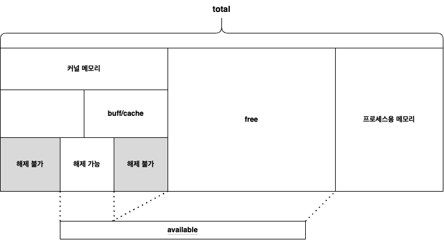

# README

다케우치 사토루의 서적 '실습과 그림으로 배우는 리눅스 구조'를 읽고 정리한 레포지토리입니다.

---

### 서평

멘토링 과정의 추천을 통해 읽게 됐습니다. 리눅스 운영체제에서 메모리를 어떻게 관리하는지를 학습했습니다. 개괄적으로 기본적인 컴퓨터의 구조로 시작해 시스템 콜, 사용자 모드와 커널 모드, 프로그램 파일의 구조, 프로세스 스케쥴러, 메모리 관리 및 계층, 파일 시스템 등 리눅스 운영체제의 여러 영역들을 살펴볼 수 있었습니다. 

관련된 소스코드는 [satoru-takeuchi-linux-in-practice 깃허브 레포지토리](https://github.com/satoru-takeuchi/linux-in-practice)에서 확인할 수 있으며, 책에 기재된 정보들은 2018년 1월 기준입니다.

---

### Q&A

- ***Q. 우리가 과연 OS에 대해서 알아야 할까요? 만약 알아야 한다면 그 이유는 무엇일까요?***
    
    최근 컴퓨터 시스템의 발전으로 대부분 계층화, 추상화, 세분화가 되어 있습니다. 즉 개발자가 OS를 몰라도 애플리케이션 개발에 병목이 생기지 않는다는 뜻입니다. 
    
    하지만 추상화되어 있고 계층화되어있는 만큼 복잡합니다. 단편적인 영역의 지식만으로는 해결할 수 없는 문제들이 많죠. 사용자에게 문제없는 서비스를 제공하기 위해서 우린 사용자 프로그램부터 OS, 커널, 심지어 하드웨어까지 전반적인 이해를 갖춰야 합니다. 그렇지 않고선 해결할 수 없는 문제의 폭이 너무 좁습니다.
    
    최대한 많은 문제를 해결할 수 있는 능력을 갖춰 사용자에게 원활한 서비스를 제공해야 합니다. 저는 이것이 OS와 하드웨어 레벨 혹은 특정 기술들의 동작 구조까지 깊게 공부해야 하는 이유라고 생각합니다.
    
- ***Q. 시스템 콜이란 무엇일까요?***
    
    CPU는 사용자 모드 혹은 커널 모드로 동작합니다. 특정 프로세스가 악의적인 의도를 갖고 하드웨어(디바이스)에 접근해 동작을 수행하는 상황을 방지하기 위해서 모드를 분리합니다. 이는 CPU의 Mode bit를 통해 가능합니다.
    
    커널은 OS의 핵심 부분이 되는 처리를 담당하는 프로그램을 말합니다. 위에서 말하는 처리에는 프로세스 관리, 프로세스 스케줄링, 메모리 관리 등이 포함됩니다. 시스템 콜은 이렇게 **커널에서만 수행 가능한 일을 처리하기 위해** **커널에 처리를 요청하는 행위**를 말합니다.
    
    시스템 콜의 종류에는 프로세스의 생성과 삭제, 메모리의 확보와 해제, 프로세스 간 통신(IPC), 네트워크 처리, 파일 시스템 핸들링, 파일 핸들링 등이 있습니다.
    
    - ***Q. 시스템 콜은 C 언어 같은 고급 언어에서는 직접 호출이 불가능한데요. 어떻게 호출할까요?***
        
        원래대로라면 아키텍쳐에 의존적인 어셈블리 코드를 사용해야 합니다. 즉 매 시스템 콜마다 아키텍쳐별 어셈블리 코드를 외워놓고 사용해야겠죠.
        
        하지만 이는 이식성 및 효율성이 너무 떨어지기 때문에 OS에서는 내부적으로 시스템 콜을 호출만을 담당하는 **시스템 콜 wrapper**라는 별도의 함수를 제공합니다.
        
        C언어에서는 glibc 라이브러리에서 제공하는 시스템 콜 wrapper 함수를 사용합니다. 
        
- ***Q. 리눅스의 메모리 구조에 대해서 설명해주세요.***
    
    
    
    메모리 구조는 위와 같습니다. 메모리 사용량이 증가하면 free 영역의 메모리가 점차 줄어들며 공간이 부족한 경우 ‘해제 가능’한 메모리 영역을 해제합니다. 만약 이 과정 이후에도 메모리가 부족한 경우 Out Of Memory, OOM 상태가 되며 메모리 관리 시스템이 적절한 프로세스를 선택해 강제 종료시켜 메모리를 확보합니다. 이를 **OOM Killer**라고 합니다.
    
    - ***Q. 리눅스의 메모리 관리 시스템은 어떻게 프로세스에 메모리를 할당할까요?***
        
        리눅스는 물리 메모리 주소를 직접 할당해주는 경우 실제 메모리들이 서로 떨어져있어 효율적인 상황이 불가능해지는 메모리 단편화 문제, 프로세스가 다른 프로세스의 메모리 주소에 접근 가능해지는 보안 문제 등이 존재합니다. 따라서 **가상 메모리 시스템**을 통해 메모리를 할당합니다. 
        
        CPU에서는 가상 주소 → 물리 주소의 변환표를 보관하는 것 외에 캐시 메모리같은 빠른 접근을 위해 **Translation Lookaside Buffer, TLB**라는 영역을 사용합니다.
        
        - ***Q. 그렇다면 가상 메모리 시스템에선 어떻게 실제 메모리로 접근할까요?***
            
            가상 메모리 시스템에서는 메모리를 페이지 단위로 나눈 뒤 페이지 테이블을 활용해 **가상 주소와 물리주소를 연결**시킵니다. 이 때 할당 이후 사용되지 않는 효율성 문제는 물리 주소 할당 여부를 표시하는 디맨드 페이징을 통해 해결합니다.
            
            구현으로는 커널의 `mmap()` 시스템 콜을 활용해 메모리 영역을 메모리 풀로 관리합니다. C언어의 경우 `malloc()`을 통해 바이트 단위로 메모리를 요청하는데, 내부적으로는 앞서 관리하는 메모리 풀의 일부 영역을 잘라 반환하는 방식으로 동작합니다.

- ***Q. 캐시 메모리가 필요한 이유는 무엇일까요?***
    
    현대의 컴퓨터는 성능이 워낙 좋아져서 계산 시간보다 메모리 접근 시간이 훨씬 깁니다. 계산을 아무리 빠르게 처리한들 메모리 접근에 걸리는 시간때문에 병목이 생긴다는 의미입니다. 이 둘의 시간 간극을 메우기 위해 필요한 것이 **캐시 메모리** 입니다.
    
    현대 프로그램 대부분은 메모리 참조의 국소성이라는 특성을 갖습니다. 특정 시점에서 접근한 데이터는 가까운 미래에 다시 접근할 것이라는 **시간 국소성(ex. 루프 처리중인 코드),** 가까운 주소에 있는 데이터를 접근할 확률이 높다는 **공간 국소성(ex. 배열 완전 탐색)**이 있습니다.
    
    - ***Q. 캐시 메모리와 CPU 레지스터 사이에 움직이는 데이터 크기는 얼마나 될까요?***
        
        이 때 메모리에서 캐시 메모리로, CPU의 레지스터로 데이터를 읽어올 때 정해진 크기를 **캐시 라인 사이즈**라고 부르며 CPU에서 지정할 수 있습니다.
        
    - ***Q. 캐시 메모리를 사용하면 역으로 쓰기 동작일 때도 캐시를 거치나요?***
        
        네 캐시를 거칩니다. 쓰기 동작을 통해 변경된 데이트를 갖는 캐시 라인은 **더티 플래그**를 통해 변경 상태를 나타냅니다. 이 후 백그라운드 프로세스를 통해 메인 메모리에 반영됩니다. 
        
        자바에서는 `volatile` 키워드를 통해 특정 변수를 메인 메모리에서 읽고 쓰도록 지정할 수 있습니다. 멀티스레드 애플리케이션에서 데이터 불일치 문제를 처리하기 위해 필요합니다.

- ***Q. 파이프 '|'에 대해서 설명해주세요.***

    파이프는 데이터가 **한 프로세스에서 다른 프로세스로 전달되도록 프로세스 바운더리를 이어주는 역할**로 프로세스끼리 서로 통신할 수 있는 2개의 파일 디스크립터를 제공하는 편리한 도구입니다. 명령들은 일반적으로 각각 독립적인 프로세스에서 실행되기 때문에 데이터 공유가 필요한데 파이프를 통해 해결합니다. 
    
    내부 구현은 양 파일 디스크럽터 사이에서 **데이터 스트림을 이어주기 위한 버퍼된 스트림(buffered stream)** 입니다. 들어오는 쪽은 읽기를 위한 FD, 반대쪽은 쓰기를 위한 FD입니다. 명령 실행을 처리하는 코드 내부에는 2개의 정수값을 저장하는 배열(array)이 생성되고, `pipe()`  호출은 그 배열에 사용 가능한 2개의 파일 디스크립터 값을(일반적으로 사용가능한 가장 낮은 숫자의 2개의 파일 디스크립터를 사용한다.) 채웁니다(populate).
